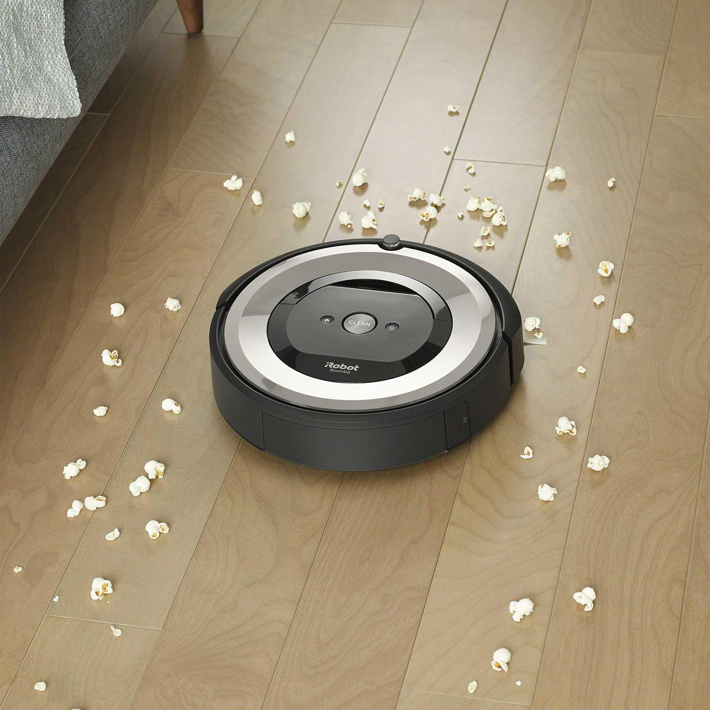
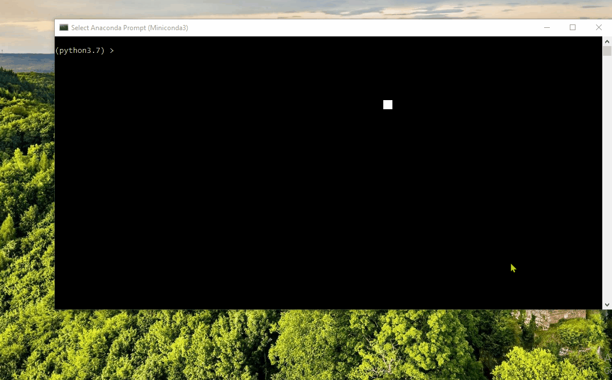
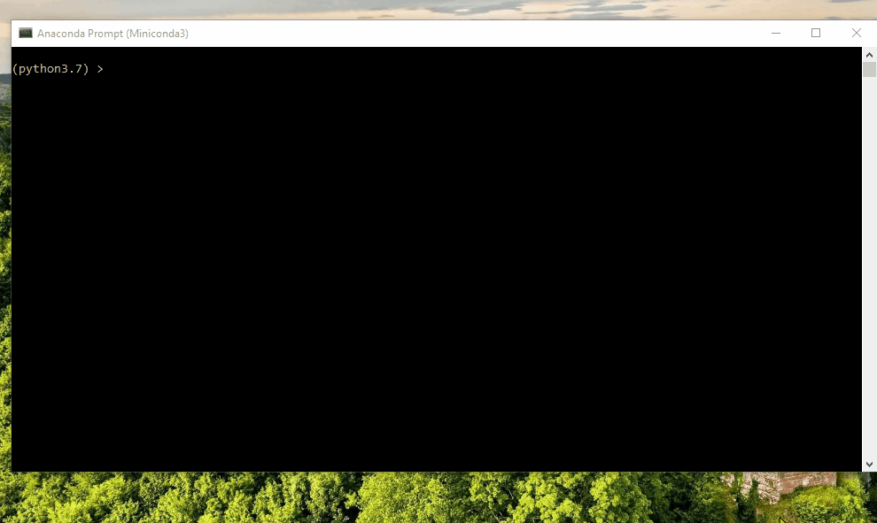
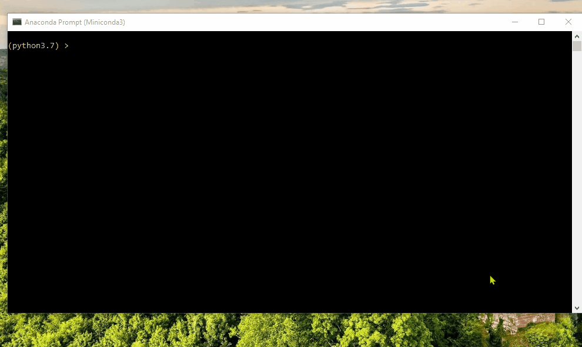

# Roomba Simulation

|  |
| :-- |
|  Picture from [samsclub.com](https://www.samsclub.com/p/irobot-roomba-e5-robot-vacuum/prod22464793)  |

In this project, I simulate Roomba-like robots to compare how much time they take to clean a room using two different strategies.

# Code in Action

In this section, we can see the final results of the implementations.

## Standard Robot

The following shows this standard robot that cleans the tiles in the room in the direction it's facing until it hits the wall. The simulation stops if 40% of the room is cleaned.

## Random Walk Robot

The following shows this robot that randomly chooses a direction and cleans the tile in there. The simulation stops if 40% of the room is cleaned.

## Comparison

### Robots vs. Time

The following shows the time it takes to clean 80% of the room for increasing number of robots.

### Time vs. Ratio

The following shows the time it takes for two robots to clean 80% of the rooms with different heights and widths.

|Width :left_right_arrow:|Height :arrow_up_down:|Width:Height :straight_ruler:|
|:--:|:--:|:--:|
|10|30||
|20|15||
|25|12||
|50|6||

